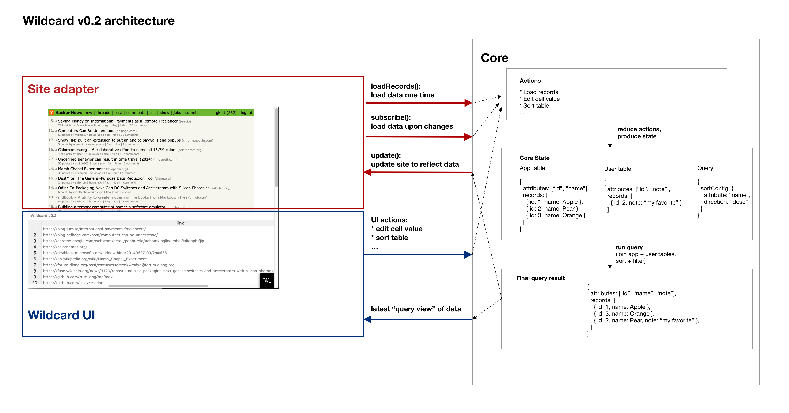

# Wildcard

Wildcard is a platform that empowers anyone to build browser extensions and modify websites to meet their own specific needs.

Wildcard shows a simplified view of the data in a web page as a familiar table view. People can directly manipulate the table to sort/filter content, add annotations, and even use spreadsheet-style formulas to pull in data from other websites.

For more details, see the [project site](https://www.geoffreylitt.com/wildcard/), or the [paper](https://www.geoffreylitt.com/wildcard/salon2020/) presented at the Convivial Computing Salon 2020.

[Sign up for the email newsletter](https://forms.gle/mpn1Hn8Ln7dmPo6T8) to get an email when the project is ready for beta users.

## Install Wildcard

Note: this project is in alpha status. Install at your own risk and don't be surprised by bugs and breaking changes. 🚧

First, download the latest release from the [releases page](https://github.com/geoffreylitt/wildcard/releases).

Then, unzip the directory and install it in your browser:

**Chrome**: [Follow these instructions](https://developer.chrome.com/extensions/getstarted#manifest) to install the directory as an unpacked Chrome extension.

**Edge**: [Follow these instructions](https://docs.microsoft.com/en-us/microsoft-edge/extensions-chromium/getting-started/part1-simple-extension#run-your-extension-locally-in-your-browser-while-developing-it-side-loading) to install the directory as an unpacked Edge extension.

**Firefox**: [Follow these instructions](https://extensionworkshop.com/documentation/develop/temporary-installation-in-firefox/) to install the manifest.json file as a temporary Firefox extension.
Note: You may need to unblock trackers in your Firefox preferences because Wildcard stores data in your browser’s local storage for persistence of changes across page loads.

To test whether it's working: try an [Airbnb search](https://www.airbnb.com/s/Miami/homes?checkin=2019-11-14&checkout=2019-11-17&adults=1&children=0&infants=0&place_id=ChIJEcHIDqKw2YgRZU-t3XHylv8&refinement_paths%5B%5D=%2Fhomes&search_type=section_navigation); the table should appear at the bottom and you should be able to sort by price. (You may need to refresh the page once to get the table to appear)

## Contribute to Wildcard

If you want to make changes to Wildcard, here are instructions for setting up Wildcard's development environment locally.

Wildcard is built in Typescript and uses yarn and rollup for packages and bundling.

[View code documentation on Github](https://geoffreylitt.github.io/wildcard/)

### Initial setup

Install dependencies:

* install [yarn](https://legacy.yarnpkg.com/en/docs/install/#mac-stable) and [rollup](https://rollupjs.org/guide/en/)
* `yarn install`
* `yarn global add concurrently`

Follow these steps to get code changes to automatically update the extension:

* Install the [Chrome Extension AutoReload](https://github.com/JeromeDane/chrome-extension-auto-reload) as an unpacked extension from source.
* From the `chrome://extensions` page, click Details -> Extension Options, and change the Reload Method to "Manage API".

### Dev workflow

Every time you develop, follow these steps.

* `yarn run dev` to start a watcher that compiles the project and updates the Chrome extension
* Compilation can take a few seconds. If a change isn't working, it might be that compilation didn't finish yet. (Improving compilation time is a todo; I think it's mostly time spent compiling Handsontable)

To test if you're able to make changes, try adding a `console.log` statement to a site adapter file like `src/site_adapters/airbnb.ts` and see if it works.

### Documentation

Documentation for the Wildcard Core is built with [Typedoc](http://typedoc.org/).
It has helpful information for e.g. building site adapters.

* [View docs for the master branch online](https://geoffreylitt.github.io/wildcard/) (hosted on Github pages from the docs directory here)
* To regenerate docs from the code, run `yarn docs`.
* To view docs locally, open `docs/index.html`.

## Understanding the codebase

### Background

It helps to understand the basic ideas of React + Redux to understand this codebase. Some good introductory reads:

* [Redux core concepts](https://redux.js.org/introduction/core-concepts)
* [Redux data flow](https://redux.js.org/basics/data-flow)
* [Thinking in React](https://reactjs.org/docs/thinking-in-react.html)

The code is split into three main modules, each with their own directory inside `src`. Here's a quick overview of the contents of each module.



### Core

Maintains system state. Defines Redux actions and reducers.

The root state object looks something like this.

```ts
{
  // Latest snapshot of data extracted from the original site.
  appTable: {
    attributes: [...], // columns of the table
    records: [...], // rows of the table
  },
  // All the user's annotations and formulas associated with this site
  userTable: {
    attributes: [...],
    records: [...],
  },
  // Configuration for the current "query" being shown:
  // * sorting metadata
  // * filtering metadata (not added yet)
  query: {
    sortConfig: {
      attribute: "name",
      direction: "asc"
    }
  }
}
```

#### Assembling query views

Note how the app's data and user's data are stored independently.
Before we can display it in the table UI, we need to combine it together.

The core contains logic for executing "queries" that
combine data extracted from the original site with
data maintained by the user, and sort/filter the result.
The query results aren't stored anywhere; they get recomputed
every time the underlying state changes in any way. This makes it trivial
to show correct data in the table UI whenever new data comes in,
either from the site adapter or the user.

#### Actions

Per the Redux pattern, system state is only modified through specified actions,
which come from the site adapter or the UI.

For example, the site adapter can dispatch a "load records" action when new
data is available, or the UI can dispatch a "sort table" action.

See `src/core/actions.ts` for a full list of actions.

### Site adapters

A Wildcard site adapter connects a specific site/application to Wildcard.
All site adapters must fulfill this abstract interface, which boils down to:

* Read data from the site, updating when necessary
* When data updates (eg user sorts or adds annotations), reify changes in the site

```ts
export interface SiteAdapter {
  // =====================
  // Reading data from the site
  // =====================

  /** Return latest data from the site */
  loadRecords():Array<Record>;

  /** Register a callback function which will be called with a new table
   *  of data anytime the data changes. */
  subscribe (callback:(table:Table) => void):void;

  // =====================
  // Modifying the site UI
  // =====================

  /** Apply a new sort order to the UI */
  applySort(finalRecords:Array<Record>, sortConfig:SortConfig):void;

  /** Apply a new annotation to the UI */
  annotateRecordInSite(id:id, newValues:any, userAttributes:Array<Attribute>):void;

  // I'm considering replacing the two functions above with a generalized
  // version that can apply arbitrary table state to the UI:

  /** Update the UI to match arbitrary table state
   *  (To implement performantly, probably do a diff inside the adapter
   *  and only update the UI where necessary) */
  update?(table:Table):void;
}
```

Currently there's one specific type of site adapter used in the system:
DOM Scraping adapters, which scrape the website DOM to fetch data,
and manipulate the DOM to update the page.

`DomScrapingBaseAdapter` is an abstract base class that new adapters
can inherit from to implement DOM scraping. A concrete DOM scraping adapter
only needs to implement one main function that scrapes data,
and the base class takes care of the rest—
see `src/site_adapters/newHN.ts` for one example of a concrete scraping adapter.

In the future we anticipate having other categories of site adapters,
which will fulfill the same abstract interface with different techniques:

* AJAX Scraping: scrape data out of AJAX JSON requests
* Redux adapter: extract data directly out of the application's internal Redux store

### UI

A Wildcard UI has these responsibilities:

* Display the table resulting from a query
* Dispatch semantic events based on user interactions

Currently there's just one UI, the `WcPanel` React Component that is a stateless table editor
component built on Handsontable. (`src/ui/WcPanel.tsx`)

The most important thing to realize is that the UI is **stateless**.
It is a pure function of the Redux state, and displays the "query view"
computed by the Core. All mutation happens by triggering Redux events.
This makes the UI have minimal responsibility, and allows for future
other UIs that view the tabular data in different ways.

`src/wildcard.ts` is the final file that pulls everything together and
injects Wildcard into the page.

### To cut a release

* create a new folder named `wildcard-<version>`
* copy the current dist folder and manifest.json to the new folder
* zip the folder. Create a new release in the Github UI and upload the zip file.

(In the future we should automate this)
