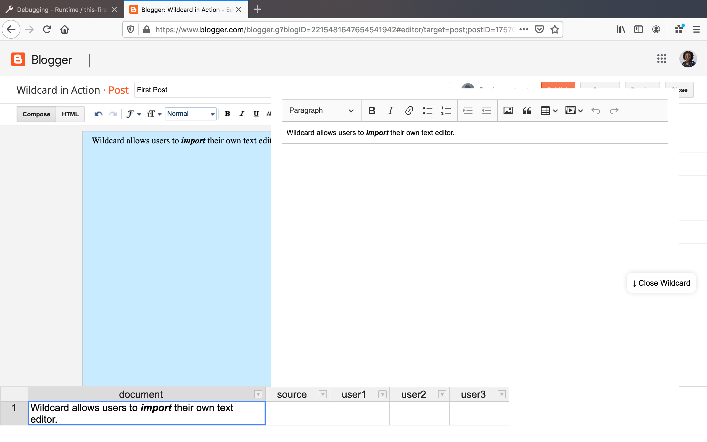

#  Example gallery

Wildcard provides a wide variety of flexibility and personalization for users. With Wildcard, you can sort elements on a page based on a metric such as price or rating, import your favorite rich text editor, or make annotations on items when shopping. 

Here are some examples of how Wildcard in use on some websites: 

#### [1. Amazon: Tallying prices and sorting](examples/amazon.md)

    

#### [2. AirBnB: Annotating listings](examples/airbnb.md)

    

#### [3. Hackernews: Finding relevant news](examples/hackernews.md)

    

#### [4. Weather: Finding the best weather](examples/weather.md)

    

#### [5. Youtube: Organizing videos by watch time](examples/youtube.md)
 

    

#### [6. Blogger: Importing rich text editors](examples/blogger.md)
 

    

