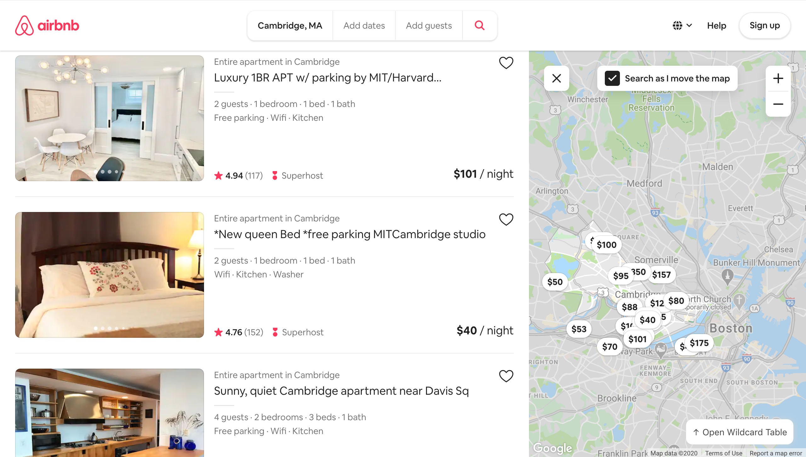

# AirBnB Demo

When people plan travel, they most likely wanted to find the most budget-friendly option for their needs. Sometimes, they prefer to find the most walkable location. The bottom line is that users have different needs when considering accommodation and Wildcard empowers them to do so.

**
 AirBnB Default View 
**

 
 
 

**
 AirBnB Default View with Wildcard Open 
**

 
 
 

**
 Users can sort listings by price 
**

 
 
 

**
 Users can also sort listings by rating 
**

 
 
 

**One really fascinating thing that you can do with Wildcard is to add annotations/comments to different listings. These annotations persist across page refreshes because they are stored in your browser's local storage.**

