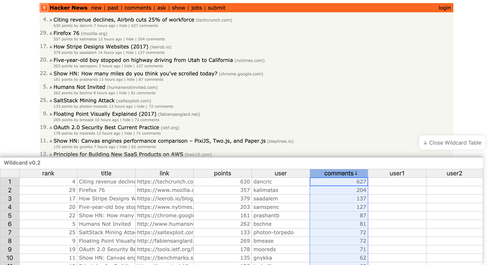

# Hackernews Demo

Hackernews is a website that is popular among developers and entrepreneurs. Anybody can create an account and add content which is presented in a timeline format (most recent first).

But sometimes, users want to see content in a different format. 

**
 Default View in Timeline Format 
**

 
 
 

**
 Default View with Wildcard opened 
**

 
 
 

**
 Content presented based on descending order of points using Wildcard 
**

 
 
 

**
 Content presented based on highest level of engagement 
**

 
 
 

**
 Users can also add their own annotations to the articles. These annotations persist across page refreshes.
**

 
